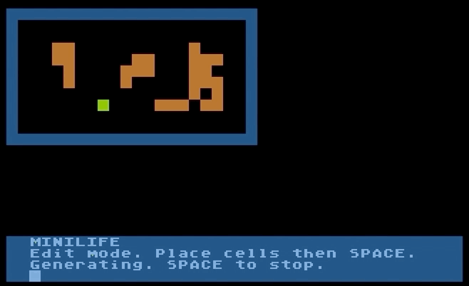

# 2019-minilife
Conway's Game of Life in Turbo BASIC XL for Atari 8-bit. Entry for 2019 10-line BASIC contest

Back to my personal theme for 10-liner entries — classic BASIC algorithms. It’s hard to get more classic than Conway’s Game of Life. This simple game/simulation was covered so times from many perspectives in Byte Magazine, Creative Computing, and so on. I used the ]algorithm as described by Mark D. Niemiec](https://archive.org/details/byte-magazine-1979-01/page/n91/mode/2up) in the January 1979 issue of Byte for my 10-liner.

My program lets you edit the starting playfield configuration, run the simulation, then optionally stop the sim to edit the playfield before continuing. At 80 characters per line, this program would fit in PUR-80, the most restrictive contest category. But after writing it I learned that the contest rules say that the PUR-80 category is limited to versions of BASIC that ship with the computer — e.g. Atari BASIC for the Atari 8-bit line. Since I wrote MINILIFE in TurboBASIC XL, and can’t convert it to Atari BASIC without making it significantly longer, I will submit it to the PUR-120 category. Boo.
